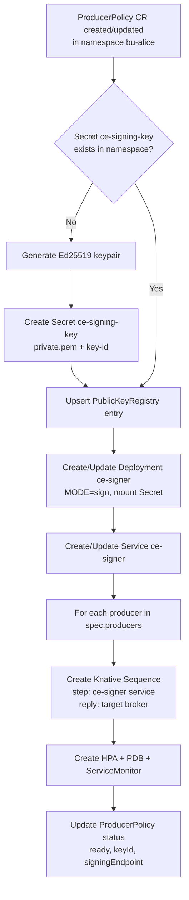
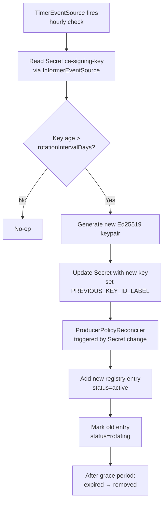
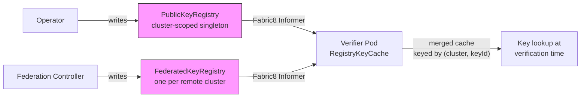
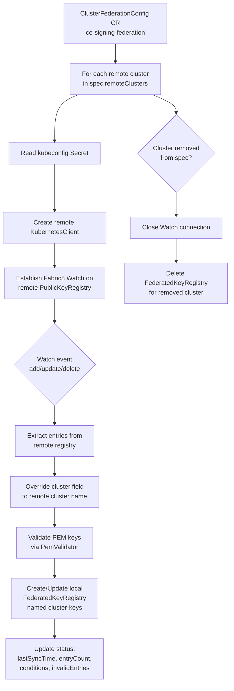
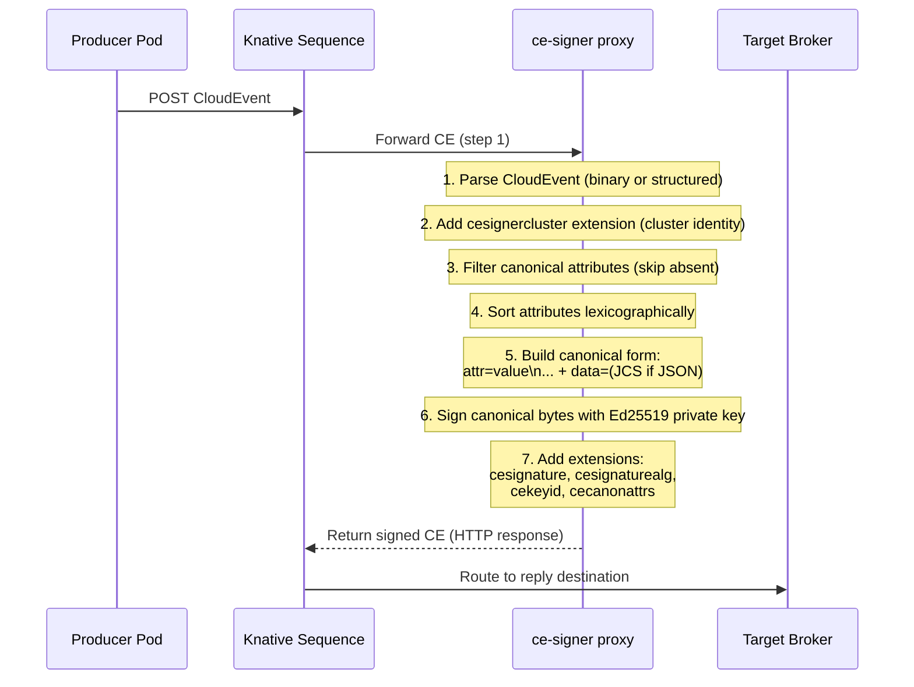
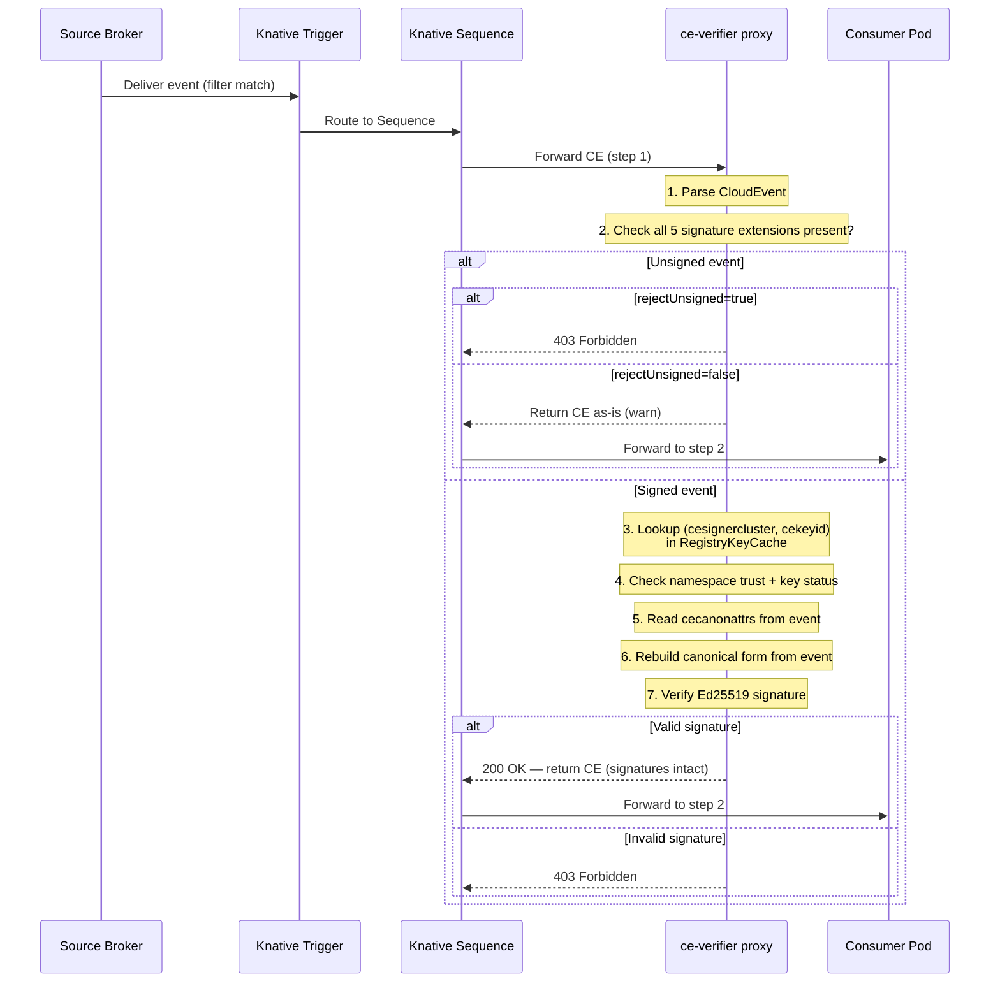
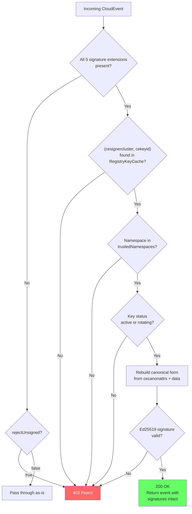
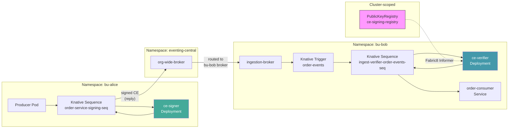
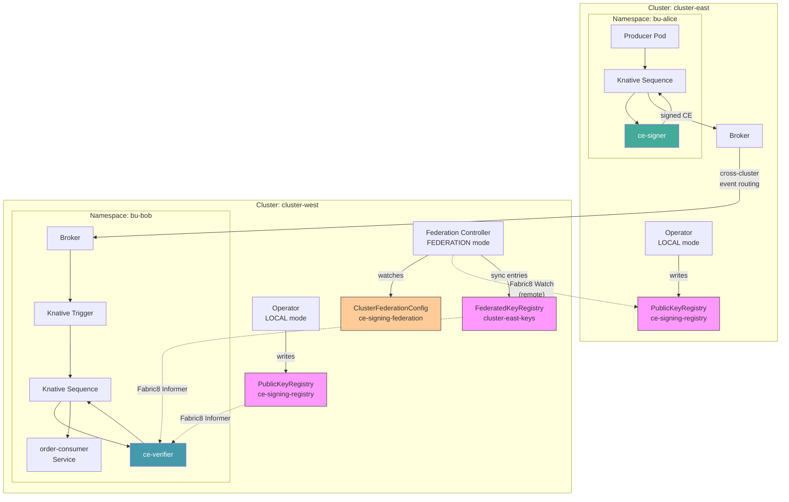

# CloudEvent Signing Platform — Control Plane & Data Plane Flows

## Overview

The platform has three distinct planes:

- **Control Plane**: The operator watches CRDs and reconciles Kubernetes resources (keys, deployments, services, Knative resources, registry entries).
- **Data Plane**: The signing and verifying proxies process CloudEvents inline via Knative Sequences. Pure request-response — no outbound HTTP calls.
- **Federation Plane** (opt-in): A separate federation controller syncs public keys from remote clusters into local `FederatedKeyRegistry` resources via Fabric8 Watches.

---

## Control Plane Flow

### Producer Policy Reconciliation

When a `CloudEventSigningProducerPolicy` CR is created or updated in a namespace:



### Key Rotation Reconciliation

A separate `KeyRotationReconciler` watches `ProducerPolicy` CRs on a `TimerEventSource` (default: hourly). When a key exceeds `rotationIntervalDays`:



### Consumer Policy Reconciliation

When a `CloudEventSigningConsumerPolicy` CR is created or updated in a namespace:


### Key Distribution (Registry Watch)

No reconciliation chain needed — verifiers watch both registries directly:



Key lifecycle in the registry:

```
active ──► rotating ──► expired ──► removed
          (grace period)
```

### Federation Reconciliation

When a `ClusterFederationConfig` CR is created or updated (opt-in, requires `federation.enabled=true` in Helm):



The federation controller runs as a separate Deployment (`OPERATOR_MODE=FEDERATION`). Metrics exposed:

| Metric | Type | Description |
|--------|------|-------------|
| `ce_signing_federation_watch_connected` | Gauge | 0/1 per remote cluster |
| `ce_signing_federation_remote_entries` | Gauge | Entry count per remote cluster |
| `ce_signing_federation_last_sync_seconds` | Gauge | Last sync timestamp |

---

## Data Plane Flow

### Signing Path (Producer Side)



### Verification Path (Consumer Side)



### Verification Decision Tree



---

## End-to-End: UC1 Cross-BU Scenario

Alice (producer) to Bob (consumer) through an untrusted central broker, **same cluster**:



**Signature extensions on the wire:**

| Extension | Value | Description |
|-----------|-------|-------------|
| `cesignature` | `<base64url 64 bytes>` | Ed25519 signature |
| `cesignaturealg` | `ed25519` | Algorithm |
| `cekeyid` | `bu-alice-v1` | Key lookup ID |
| `cecanonattrs` | `cesignercluster,datacontenttype,source,subject,type` | Signed attributes (sorted) |
| `cesignercluster` | `cluster-east` | Signing cluster identity |

These extensions survive any number of intermediate brokers and are **not stripped** by the verifier.

---

## End-to-End: UC2 Cross-Cluster Federation Scenario

Alice (producer in **cluster-east**) to Bob (consumer in **cluster-west**). The federation controller in cluster-west syncs Alice's public key so Bob's verifier can validate the signature:



**Federation setup on cluster-west:**

```yaml
# 1. Kubeconfig Secret for remote access
apiVersion: v1
kind: Secret
metadata:
  name: cluster-east-kubeconfig
  namespace: ce-signing-system
type: Opaque
data:
  kubeconfig: <base64-encoded kubeconfig for cluster-east>
---
# 2. ClusterFederationConfig declaring the remote cluster
apiVersion: ce-signing.platform.io/v1alpha1
kind: ClusterFederationConfig
metadata:
  name: ce-signing-federation
spec:
  remoteClusters:
    - name: cluster-east
      kubeconfigSecretRef: cluster-east-kubeconfig
```

**Verification flow for cross-cluster events:**

1. Event arrives at cluster-west with `cesignercluster=cluster-east` and `cekeyid=bu-alice-v1`
2. Verifier looks up composite key `(cluster-east, bu-alice-v1)` in `RegistryKeyCache`
3. Cache contains the key because `FederatedKeyRegistry/cluster-east-keys` was synced by the federation controller
4. Signature is verified using the federated public key — **no direct cross-cluster call at verification time**

**Consistency model:** AP (Availability + Partition tolerance). During network partitions, verifiers serve from the last successfully synced `FederatedKeyRegistry`. Key revocations on the remote cluster propagate once connectivity is restored.

---

## Resource Topology Summary

```
Control Plane (operator — LOCAL mode):    Data Plane (proxies):
  Watches CRDs ──► Creates resources        Pure request → response
  Manages keys ──► Publishes to registry    No outbound HTTP calls
  Reconciles   ──► Updates status           Knative Sequences own delivery

Per producer namespace:                   Per consumer namespace:
  1 Secret (keypair)                        1 ServiceAccount (ce-signing-verifier)
  1 Deployment (ce-signer)                  1 ClusterRoleBinding
  1 Service                                 1 Deployment (ce-verifier)
  N Sequences (signer → reply)              1 Service
  1 HPA, 1 PDB, 1 ServiceMonitor           N Sequences (verifier → consumer)
                                            N Triggers (broker → Sequence)

Federation (opt-in — FEDERATION mode):
  1 Deployment (ce-signing-operator-federation)
  1 ServiceAccount + ClusterRoleBinding
  1 ClusterFederationConfig (singleton)
  N FederatedKeyRegistries (one per remote cluster)
```
