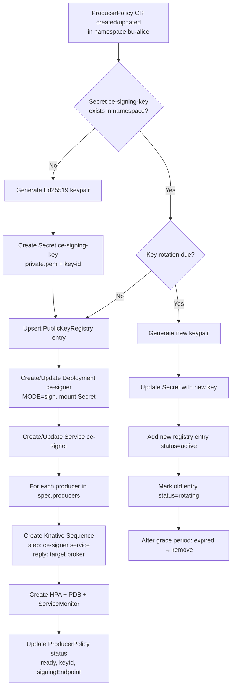
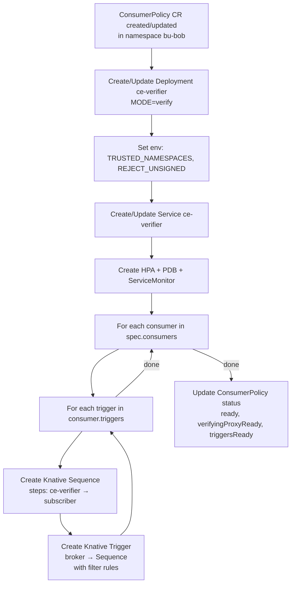
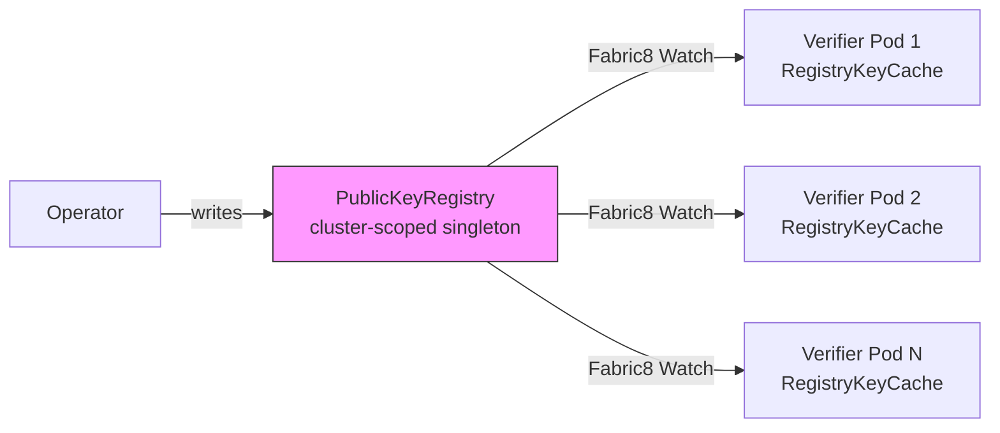
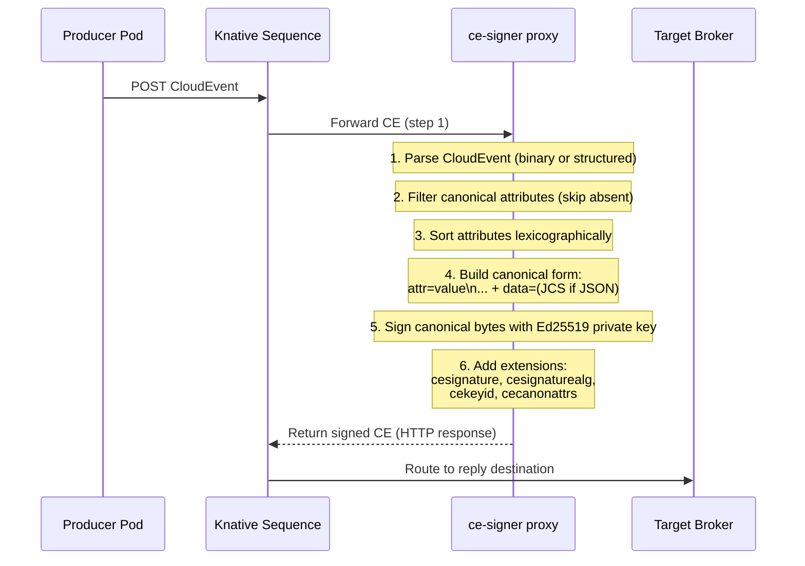
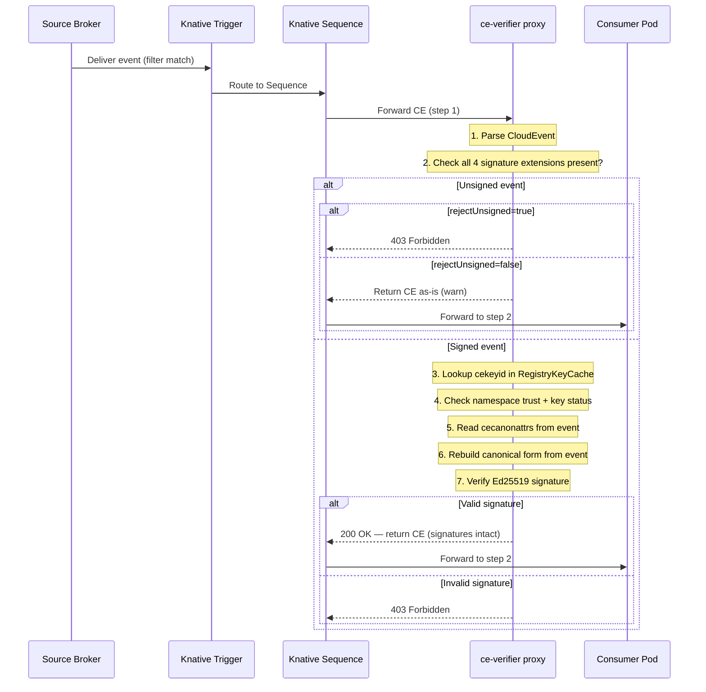
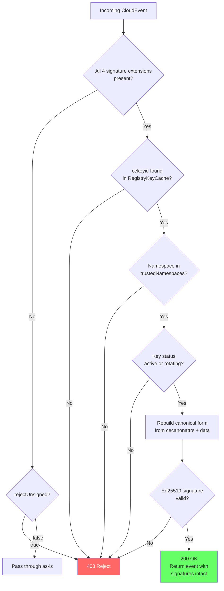

# CloudEvent Signing Platform — Control Plane & Data Plane Flows

## Overview

The platform has two distinct planes:

- **Control Plane**: The operator watches CRDs and reconciles Kubernetes resources (keys, deployments, services, Knative resources, registry entries).
- **Data Plane**: The signing and verifying proxies process CloudEvents inline via Knative Sequences. Pure request-response — no outbound HTTP calls.

---

## Control Plane Flow

### Producer Policy Reconciliation

When a `CloudEventSigningProducerPolicy` CR is created or updated in a namespace:



### Consumer Policy Reconciliation

When a `CloudEventSigningConsumerPolicy` CR is created or updated in a namespace:



### Key Distribution (Registry Watch)

No reconciliation chain needed — verifiers watch the registry directly:



Key lifecycle in the registry:

```
active ──► rotating ──► expired ──► removed
          (grace period)
```

---

## Data Plane Flow

### Signing Path (Producer Side)



### Verification Path (Consumer Side)



### Verification Decision Tree



---

## End-to-End: UC1 Cross-BU Scenario

Alice (producer) to Bob (consumer) through an untrusted central broker:


**Signature extensions on the wire:**

| Extension | Value | Description |
|-----------|-------|-------------|
| `cesignature` | `<base64url 64 bytes>` | Ed25519 signature |
| `cesignaturealg` | `ed25519` | Algorithm |
| `cekeyid` | `bu-alice-v1` | Key lookup ID |
| `cecanonattrs` | `datacontenttype,source,subject,type` | Signed attributes (sorted) |

These extensions survive any number of intermediate brokers and are **not stripped** by the verifier.

---

## Resource Topology Summary

```
Control Plane (operator):                Data Plane (proxies):
  Watches CRDs ──► Creates resources       Pure request → response
  Manages keys ──► Publishes to registry   No outbound HTTP calls
  Reconciles   ──► Updates status          Knative Sequences own delivery

Per producer namespace:                  Per consumer namespace:
  1 Secret (keypair)                       1 Deployment (ce-verifier)
  1 Deployment (ce-signer)                 1 Service
  1 Service                                N Sequences (verifier → consumer)
  N Sequences (signer → reply)             N Triggers (broker → Sequence)
  1 HPA, 1 PDB, 1 ServiceMonitor          1 HPA, 1 PDB, 1 ServiceMonitor
```
